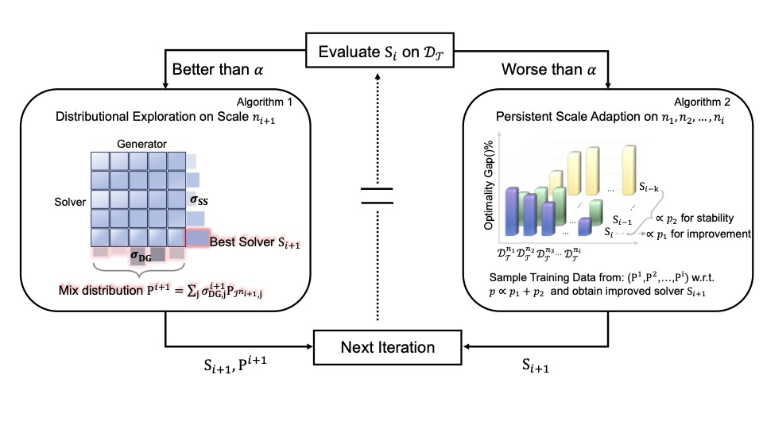
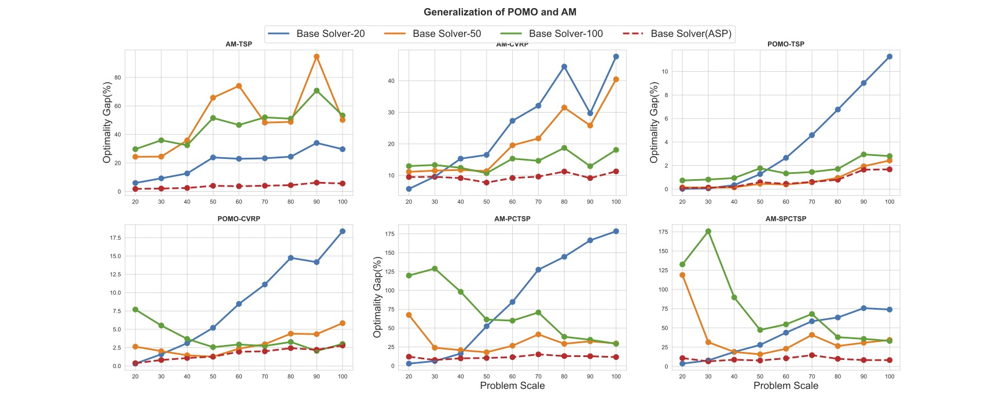

# ASP: Learn a Universal Neural Solver!

This repo implements paper [Wang C, Yu Z, McAleer S, et al. ASP: Learn a Universal Neural Solver![J]. IEEE Transactions on Pattern Analysis and Machine Intelligence, 2024.](https://ieeexplore.ieee.org/abstract/document/10387785) which improves the generalization ability of neural solvers on unseen distributions and a range of problem scales.

```commandline
@article{wang2024asp,
  title={ASP: Learn a Universal Neural Solver!},
  author={Wang, Chenguang and Yu, Zhouliang and McAleer, Stephen and Yu, Tianshu and Yang, Yaodong},
  journal={IEEE Transactions on Pattern Analysis and Machine Intelligence},
  year={2024},
  publisher={IEEE}
}
```



## Installation
### Bssic environment settings
Our code run perfectly on Ubuntu18.04, CUDA version 11.4 and python3.8. The basic environment settings are as follows:
``` Bash
Python=3.8
PyTorch=1.10.2
open_spiel=1.1.0
or-tools
wandb
tsplib95
```

# Code Structure
This repo includes existing neural solvers implementation for various combinatorial optimization problems, we try to maintain the original code struture
and make the minimal changes on them to work through our pipeline. These neural solvers are included in:
```commandline
- NeuralSolver
    - problem (e.g. TSP, CVRP...)
        - method (e.g. AM, POMO)
```
The high level configuration is in run.py and the specific configuration for Neural Solver and Flow networks are in `./config` folder

In this implementation, we need some oracle solvers (like LKH, or-tools) to update the meta-payoff matrix in PSRO pipeline, you need 
set these solvers in advance. 

For or-tools, you can set it easily by pip.

For LKH, it will be configured once you run the code. If it's not installed successfully, you need to set [LKH](http://webhotel4.ruc.dk/~keld/research/LKH-3/)
by yourself in the `./OracleSolver` folder.

For setting LKH, you need go to `./OracleSolver/lkh` and find `LKH-3.0.9.tgz`, then run the following commands in terminal:
```
tar xvfz LKH-3.0.9.tgz
cd LKH-3.0.9
make
```


# How To Run
## Training
```python
CUDA_VISIBLE_DEVICES=0 python run.py --create_dir --task_description train-tsp-pomo --problem TSP --method POMO  --performance_thres .5
```
If you want to resume the training , you can use:
```python 
--load_resume
```
to specify the dir of your asp_info.pt. We provide our game info in dir './save_asp' and you can run in the following way:
```python
CUDA_VISIBLE_DEVICES=0 python run.py --create_dir --task_description train-tsp-pomo --problem TSP --method POMO  --performance_thres .5 --load_resume ./save_asp/TSP/POMO/tsp_pomo/all_best_asp_info.pt
```

## Evaluation
For providing a complete fair comparison environment, you can test the obtained neural solver from ASP using the corresponding neural solver's open-source codes by 
loading the model parameters `'solver_param'` in saved asp_info.pt.


## Some Results
### Improvement Over Base Solver on Generated Data
Comparison results of base solver(ASP) with various baselines. For learning-based methods, the comparison is between **one** base solver(ASP) and **several** 
separated trained neural solvers. The results of real-world instances from TSPLib and CVRPLib can be found in the paper.


### Ablations on the validity of ASP


### Ablations on the Task Selection Strategy


### Generalization Results



## Acknowledgements
ASP is based on several existing neural solvers:

[Attention Model (AM):](https://github.com/wouterkool/attention-learn-to-route) https://github.com/wouterkool/attention-learn-to-route

[POMO:](https://github.com/yd-kwon/POMO) https://github.com/yd-kwon/POMO

and the implementation of Flow-based model Real-NVP is from:

[RealNVP:](https://github.com/karpathy/pytorch-normalizing-flows) https://github.com/karpathy/pytorch-normalizing-flows

We are appreciated for all the open-sources.
